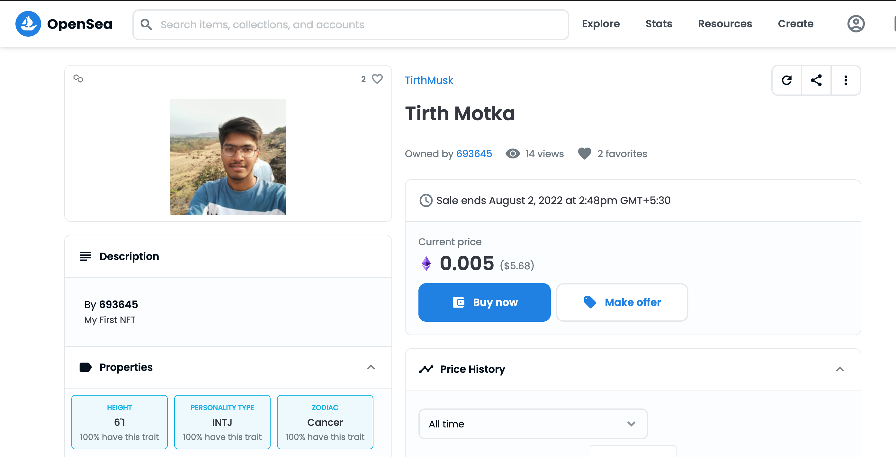

# My first NFT minting project

Opensea screenshot:

This project demonstrates a basic Hardhat use case for minting my own nft using solidity basics and matic network.
there are two ways to mint nft:
1. locally using goerly test network
2. using matic or ethereum network 

some of the commands that we can run in hardhat are:

```shell
npx hardhat accounts
npx hardhat compile
npx hardhat clean
npx hardhat test
npx hardhat node
node scripts/sample-script.js
npx hardhat help
```

<!-- https://ibb.co/CzfH0CM
https://i.ibb.co/CzfH0CM/IMG20220417074530.jpg
https://jsonkeeper.com/b/X1PH -->